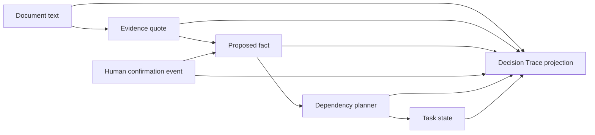

# Decision Trace code tour

Decision Trace is Lantern's inspectability layer. It answers a narrow but important question: **why did this plan step receive this state?** It does not generate a persuasive explanation after the fact. It projects the exact source records, family or school decisions, dependency rules, and planner result that already exist in the case.

## The data path



The core data structures are in [`app/features/first-day/domain/types.ts`](../../app/features/first-day/domain/types.ts). A case contains documents, evidence quotes, facts, procedures, task dependencies, conflicts, and an append-only event list. Facts point to evidence IDs; evidence points to a source document or reviewed procedure. Tasks declare dependencies as `fact`, `task`, `allOf`, or `anyOf` values instead of hiding prerequisites in UI code.

## Immutable decisions

[`app/features/first-day/domain/events.ts`](../../app/features/first-day/domain/events.ts) appends typed events for fact confirmation, correction, uncertainty, task completion, completion reversal, source removal, and school confirmation. Existing records are not rewritten to make a new answer look as though it was always known.

For the fictional orientation conflict, the user records what the school said. [`app/features/first-day/domain/conflicts.ts`](../../app/features/first-day/domain/conflicts.ts) validates that the selected fact belongs to the conflict and appends a `school_confirmation_recorded` event. The competing value remains in the case as `superseded`, preserving what the family originally received and why clarification was necessary.

## One authoritative planner

[`app/features/first-day/domain/planner.ts`](../../app/features/first-day/domain/planner.ts) is the only component that derives task states. It replays case events, evaluates source removal and procedure eligibility, recursively evaluates dependencies, and returns `ready`, `needs_clarification`, `waiting`, `done`, or `needs_review` with a reason.

The planner is deterministic: identical case input produces identical output. It does not call an AI provider, a network service, the browser clock, or random ID generation. Missing references and dependency cycles are reported rather than silently treated as satisfied.

## A read-only provenance projection

[`app/features/first-day/domain/decision-trace.ts`](../../app/features/first-day/domain/decision-trace.ts) receives the case, the already-computed planner result, and a task ID. It walks the task's dependency tree and gathers:

- the final task state and reason copied from the planner;
- dependency groups in stable traversal order;
- the effective state of every referenced fact after event replay;
- the latest relevant human confirmation event;
- exact evidence quotes and their document labels;
- supporting procedure records; and
- explicit warnings for missing facts, tasks, evidence, documents, or procedures.

The projection uses typed nodes and edges so the relationship is testable, but it does not render a free-form graph. It deduplicates repeated nodes, preserves first-seen order, and creates no random or time-dependent values. An unknown top-level task is a programmer error; broken references inside an otherwise valid task become visible warnings.

## A readable interface, not a black box

[`app/features/first-day/ui/decision-trace-panel.tsx`](../../app/features/first-day/ui/decision-trace-panel.tsx) renders the projection as a five-stage vertical explanation:

1. source evidence;
2. proposed facts and their current states;
3. the human decision, if one exists;
4. dependency logic; and
5. the planner result.

This layout was chosen over a draggable graph because a judge or family can read it in one direction on desktop, mobile, keyboard navigation, or print. Quotes use semantic `blockquote` elements, status is written in text rather than communicated only by color, and the decorative connector is CSS. No content depends on animation or an intersection observer to become visible.

[`app/features/first-day/ui/plan-step.tsx`](../../app/features/first-day/ui/plan-step.tsx) builds a trace only for the task the user opens. [`app/features/first-day/ui/use-first-day-controller.ts`](../../app/features/first-day/ui/use-first-day-controller.ts) owns the selected trace ID. When a school answer resolves the orientation conflict, the controller appends the same normal case event, moves to the normal plan screen, and opens the related task's trace. There is no second judge-only reasoning engine.

The controller's `resetDemo` operation restores a fresh clone of the canonical fictional case and clears modal, filter, toast, highlight, conflict, trace, and demo-beat state while preserving the selected language. This makes repeated judging rehearsals deterministic without a page reload.

## The same event serves every output

One `school_confirmation_recorded` event feeds several independent consumers:

- the planner recomputes only states that depend on the selected fact;
- the task card shows the focused update;
- Decision Trace shows who made the decision and which fact was selected;
- [`app/features/first-day/export/plan-document.ts`](../../app/features/first-day/export/plan-document.ts) includes the effective confirmed fact; and
- the JSON export retains the event history for inspection.

That shared event path is the main integrity constraint. A demo cannot claim a state that the normal planner and export do not also produce.

## Verification

[`tests/first-day/decision-trace.test.ts`](../../tests/first-day/decision-trace.test.ts) covers unresolved and resolved conflicts, nested dependencies, stable ordering, missing references, and invalid caller input. [`tests/first-day/decision-trace-panel.test.ts`](../../tests/first-day/decision-trace-panel.test.ts) checks semantic reading order and the unresolved-decision explanation. [`e2e/first-day-fictional.spec.ts`](../../e2e/first-day-fictional.spec.ts) runs the judge journey in a real browser, verifies the trace content, exercises keyboard close and reopen, confirms provider-free execution, and proves that reset restores the original blocker while preserving language.

Run the release checks with:

```bash
npm run lint
npm test
npm run build
npx playwright test
```

## AI assistance and student responsibility

OpenAI Codex assisted with repository inspection, implementation planning, code and test drafting, debugging, official-source review, browser verification, and documentation drafting. Isaac Gong owns the product goal, audience, architecture choices, evidence and event model, planner rules, trace behavior, visual decisions, test expectations, evaluation interpretation, and release decisions. The submitted project should include only code Isaac understands and can explain. The complete disclosure is in [`docs/submission/ai-disclosure.md`](ai-disclosure.md).
