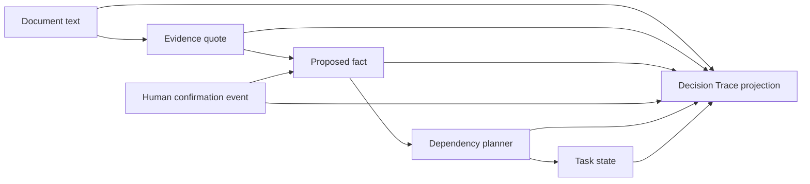

# Lantern Decision Trace and Judge Mode Implementation Plan

> **For agentic workers:** REQUIRED SUB-SKILL: Use test-driven development for each task and complete the tasks in order. Do not weaken an assertion to make a failing implementation pass.

**Goal:** Make Lantern's core reasoning inspectable by letting a judge trace any plan task from original document text through extracted facts, a human decision, dependency evaluation, and the resulting task state; make the guided demo repeatable with one reset action.

**Architecture:** Add a pure domain projection that turns the existing immutable case data and planner result into a stable `DecisionTrace`. The projection does not own state or reimplement planning: the planner remains authoritative for task outcomes, while the trace explains the inputs that produced them. UI state for opening a trace lives in the existing controller so a conflict resolution can reveal the changed trace automatically and reset can clear the entire demo. The interface uses semantic HTML and CSS-first disclosure so all explanatory content remains available without animation.

**Tech Stack:** Next.js App Router, React 19, TypeScript, Vitest, Testing Library, Playwright, Tailwind/CSS.

---

## Scope and gates

This is the first implementation subproject from the approved competition design. It deliberately excludes research recruitment, submission-video production, analytics, accounts, persistence, and new district integrations. Those remain later gated subprojects after this feature is stable.

Definition of done:

- Every rendered plan task offers a keyboard-accessible “Trace this decision” action.
- The trace includes the task result, dependency logic, relevant facts, source quotes, source documents, procedure rules, and the latest human conflict decision when one exists.
- Resolving the fictional orientation conflict opens the newly updated orientation trace automatically.
- Reset returns the guided demo to its untouched opening state without a page reload.
- Missing references become visible trace warnings rather than crashes.
- Unit, component, browser, lint, and production-build checks pass.

## Task 1: Define and test the pure trace projection

**Files:**

- Create: `app/features/first-day/domain/decision-trace.ts`
- Create: `tests/first-day/decision-trace.test.ts`
- Reference: `app/features/first-day/domain/types.ts`
- Reference: `app/features/first-day/domain/planner.ts`
- Reference: `app/features/first-day/content/fictional-case.ts`

**Step 1: Write failing tests for the public contract**

Cover these cases with `buildDecisionTrace(caseData, plan, taskId)`:

1. An unresolved orientation task returns `needs_clarification`, both competing facts, both evidence quotes and document labels, and no decision node.
2. After a `school_confirmation_recorded` event, the trace returns the planner's `ready` result, a human-decision node containing the reported value, one confirmed fact, and one superseded fact.
3. A task with a nested `allOf`/`anyOf` dependency retains group structure and stable source order.
4. A missing fact, task, evidence, document, or procedure reference adds a warning node/message and does not throw.
5. An unknown requested task throws a precise programmer error because the UI must never request a task that does not exist in the planner result.

The public types are explicit and serializable:

```ts
export type DecisionTraceNodeKind =
  | "task"
  | "dependency"
  | "decision"
  | "fact"
  | "evidence"
  | "document"
  | "procedure"
  | "warning";

export type DecisionTraceNode = {
  id: string;
  kind: DecisionTraceNodeKind;
  label: string;
  detail: string;
  state?: ConfirmationState | PlanState;
  sourceId?: string;
};

export type DecisionTraceEdge = {
  id: string;
  from: string;
  to: string;
  relation:
    | "evaluates"
    | "contains"
    | "depends_on"
    | "decides"
    | "supports"
    | "quoted_from"
    | "governed_by"
    | "warns";
};

export type DecisionTrace = {
  taskId: string;
  title: string;
  state: PlanState;
  reason: string;
  nodes: DecisionTraceNode[];
  edges: DecisionTraceEdge[];
  warnings: string[];
};
```

**Step 2: Prove the tests fail for the missing module**

Run:

```bash
npm test -- tests/first-day/decision-trace.test.ts
```

Expected: FAIL because `decision-trace.ts` does not exist.

**Step 3: Implement the smallest deterministic projection**

Implementation rules:

- Find the final `DerivedTask` in the supplied `PlannerResult`; copy its state and reason verbatim.
- Walk `Dependency` recursively. Group IDs derive from a stable path such as `dependency:task-orientation:root.0`.
- Reconstruct fact display state only from the fact's original state plus case events in event order, matching the existing planner semantics for confirmation, correction, uncertainty, and school conflict resolution.
- Add evidence and document nodes only once even when referenced by multiple facts.
- Attach task-level evidence and procedures even when no fact dependency points to them.
- Add the latest applicable school-confirmation event as a decision node.
- Deduplicate nodes by ID and edges by `(from, relation, to)` while preserving first-seen order.
- Record missing references in both `warnings` and warning nodes.
- Never call React, the network, `Date.now`, or random ID generation.

**Step 4: Run the focused and planner suites**

Run:

```bash
npm test -- tests/first-day/decision-trace.test.ts tests/first-day/planner.test.ts
```

Expected: PASS.

**Step 5: Commit the domain slice**

```bash
git add app/features/first-day/domain/decision-trace.ts tests/first-day/decision-trace.test.ts
git commit -m "feat: add inspectable decision trace model"
```

## Task 2: Add an accessible Decision Trace panel

**Files:**

- Create: `app/features/first-day/ui/decision-trace-panel.tsx`
- Modify: `app/features/first-day/ui/plan-step.tsx`
- Modify: `app/features/first-day/ui/first-day-copy.ts`
- Modify: `app/styles/first-day.css`
- Create: `tests/first-day/decision-trace-panel.test.tsx`

**Step 1: Write failing component tests**

Render a resolved orientation trace and assert:

- The panel is labelled “Decision trace: Confirm where orientation begins”.
- The first summary communicates the final state and planner reason.
- Sections appear in this reading order: outcome, human decision, dependency logic, facts, source evidence, rules/warnings.
- Source quotes use `<blockquote>` and document labels remain visible.
- A close control has an accessible name and invokes `onClose`.
- State is never communicated by color alone.

Render an unresolved trace and assert the human-decision section explains that no decision is recorded yet rather than disappearing silently.

**Step 2: Verify the component test fails**

Run:

```bash
npm test -- tests/first-day/decision-trace-panel.test.tsx
```

Expected: FAIL because the component does not exist.

**Step 3: Implement semantic trace rendering**

Use this component contract:

```tsx
export function DecisionTracePanel({
  language,
  onClose,
  trace,
}: {
  language: Language;
  onClose: () => void;
  trace: DecisionTrace;
})
```

Render a vertical explanation, not a free-form graph canvas:

- Header: final state badge, title, reason, close button.
- Ordered stages: `1 Source`, `2 Fact`, `3 Human decision`, `4 Dependency`, `5 Plan result`.
- Evidence quotes and document provenance stay adjacent.
- Connecting lines are decorative CSS only and disappear cleanly in print/reduced-motion modes.
- No content starts at opacity zero and no observer is required to reveal it.

**Step 4: Integrate the panel into each task card**

Extend `PlanStepProps` with:

```ts
traceTaskId: string | null;
onOpenTrace: (taskId: string) => void;
onCloseTrace: () => void;
```

For each task:

- Render a “Trace this decision” button beside “Why this status”.
- When `traceTaskId === task.id`, call `buildDecisionTrace(caseData, plan, task.id)` and render the panel immediately after that task's actions.
- Give the opened card an additional class for orientation but do not scroll or steal focus automatically.
- Localize new user-facing copy in English and Spanish.

**Step 5: Add premium, restrained styling**

Add `fd-trace-*` styles using the existing Lantern palette. Use a narrow spine, compact node cards, monospaced provenance labels, responsive single-column layout, visible focus rings, and `prefers-reduced-motion`. Avoid adding a charting library.

**Step 6: Run component and type-adjacent tests**

```bash
npm test -- tests/first-day/decision-trace-panel.test.tsx tests/first-day/decision-trace.test.ts
npm run lint
```

Expected: PASS.

**Step 7: Commit the UI slice**

```bash
git add app/features/first-day/ui/decision-trace-panel.tsx app/features/first-day/ui/plan-step.tsx app/features/first-day/ui/first-day-copy.ts app/styles/first-day.css tests/first-day/decision-trace-panel.test.tsx
git commit -m "feat: visualize decision provenance in plan tasks"
```

## Task 3: Wire trace state and automatic judge-demo reveal

**Files:**

- Modify: `app/features/first-day/ui/use-first-day-controller.ts`
- Modify: `app/features/first-day/ui/first-day-workspace.tsx`
- Modify: `tests/first-day/demo-presentation.test.ts`
- Modify: `e2e/first-day-fictional.spec.ts`

**Step 1: Add a failing browser assertion**

Extend the fictional happy path:

1. Resolve the orientation conflict as “Gym entrance”.
2. Assert the plan appears and the orientation task is `Ready`.
3. Assert its trace is already expanded.
4. Assert the trace shows the school-confirmed value, both original source quotes, `confirmed`/`superseded` fact states, and the final planner reason.
5. Close and reopen the trace with keyboard activation.

**Step 2: Add controller-owned trace state**

Add:

```ts
const [traceTaskId, setTraceTaskId] = useState<string | null>(null);
```

Expose `openDecisionTrace`, `closeDecisionTrace`, and `traceTaskId`. Clear it when changing cases or leaving the workspace. In `resolveCaseConflict`, set it to the first related task ID at the same time as `highlightedTaskId`; this is the single automatic reveal and it uses the same case event and planner result as the normal workflow.

**Step 3: Wire workspace props**

Pass trace state and callbacks from `FirstDayWorkspace` into `PlanStep`. Do not create a second demo-only trace implementation.

**Step 4: Run the focused browser flow**

```bash
npx playwright test e2e/first-day-fictional.spec.ts --project=chromium
```

Expected: PASS.

**Step 5: Commit the orchestration slice**

```bash
git add app/features/first-day/ui/use-first-day-controller.ts app/features/first-day/ui/first-day-workspace.ts tests/first-day/demo-presentation.test.ts e2e/first-day-fictional.spec.ts
git commit -m "feat: reveal updated trace after human confirmation"
```

## Task 4: Add a deterministic judge-demo reset

**Files:**

- Modify: `app/features/first-day/ui/use-first-day-controller.ts`
- Modify: `app/features/first-day/ui/demo-ribbon.tsx`
- Modify: `app/features/first-day/ui/first-day-workspace.tsx`
- Modify: `app/features/first-day/ui/first-day-copy.ts`
- Modify: `e2e/first-day-fictional.spec.ts`

**Step 1: Write the failing reset journey**

After resolving the orientation conflict and opening the trace, click “Reset demo” and assert:

- The demo returns to beat 1 and Documents step.
- The orientation conflict is open again.
- No trace, source modal, toast, task filter, or highlighted task remains.
- The selected interface language is preserved.
- Advancing through the demo still works after reset.

**Step 2: Implement a single reset operation**

Add `resetDemo()` to the controller. It creates a fresh fictional case from the canonical fixture, preserves the current language, recomputes the planner, and resets every transient controller field. It must not reload the page or mutate the imported fixture.

**Step 3: Expose the action in DemoRibbon**

Add an `onReset` prop and a secondary “Reset demo” button. Keep “Exit demo” distinct: reset preserves guided mode; exit switches presentation mode.

**Step 4: Run focused unit and browser tests**

```bash
npm test -- tests/first-day/demo-presentation.test.ts
npx playwright test e2e/first-day-fictional.spec.ts --project=chromium
```

Expected: PASS.

**Step 5: Commit the reset slice**

```bash
git add app/features/first-day/ui/use-first-day-controller.ts app/features/first-day/ui/demo-ribbon.tsx app/features/first-day/ui/first-day-workspace.tsx app/features/first-day/ui/first-day-copy.ts e2e/first-day-fictional.spec.ts
git commit -m "feat: make the judge demo instantly repeatable"
```

## Task 5: Document the technical story and verify the release gate

**Files:**

- Modify: `README.md`
- Create: `docs/submission/decision-trace-code-tour.md`
- Modify: `docs/submission/ai-disclosure.md` if the implementation changes the existing disclosure facts

**Step 1: Write the code tour**

Document, with exact file links and no inflated claims:

- The immutable event log.
- The planner as the authoritative state transition engine.
- The trace as a read-only provenance projection.
- Why the UI uses a readable vertical trace instead of an opaque graph visualization.
- How the same resolution event powers normal mode, judge mode, export, and the trace.
- Which code was student-authored and how AI assistance was used and reviewed.

Include one Mermaid diagram:



**Step 2: Update the README quick start**

Add a short “Judge demo” section: start locally, choose fictional demo, resolve the orientation conflict, inspect the automatically opened trace, reset.

**Step 3: Run the complete release gate**

```bash
npm run lint
npm test
npm run build
npx playwright test
git diff --check
```

Expected: all checks PASS with no unreviewed snapshots, no console errors, and no whitespace errors.

**Step 4: Manually inspect responsive states**

Verify at approximately 390×844 and 1440×1000:

- Unresolved orientation trace.
- Resolved orientation trace.
- Long source quote wrapping.
- Spanish labels.
- Keyboard focus order.
- Reduced-motion behavior.
- Print output does not include demo controls.

If screenshots are intentionally updated, inspect each image before committing it.

**Step 5: Commit documentation and any verified snapshot updates**

```bash
git add README.md docs/submission/decision-trace-code-tour.md docs/submission/ai-disclosure.md
git commit -m "docs: explain Lantern decision provenance architecture"
```

## Follow-on subprojects after this gate

Do not start these until Tasks 1–5 pass:

1. **Small usability validation:** five adults, synthetic case only, task script, anonymized observations, before/after changes.
2. **Competition hardening:** accessibility audit, performance budget, failure-state matrix, cross-browser pass, deployed demo health check.
3. **Submission package:** 1–3 minute script and recording, code-tour notes, written responses, screenshots, final AI disclosure, public-link rehearsal.

